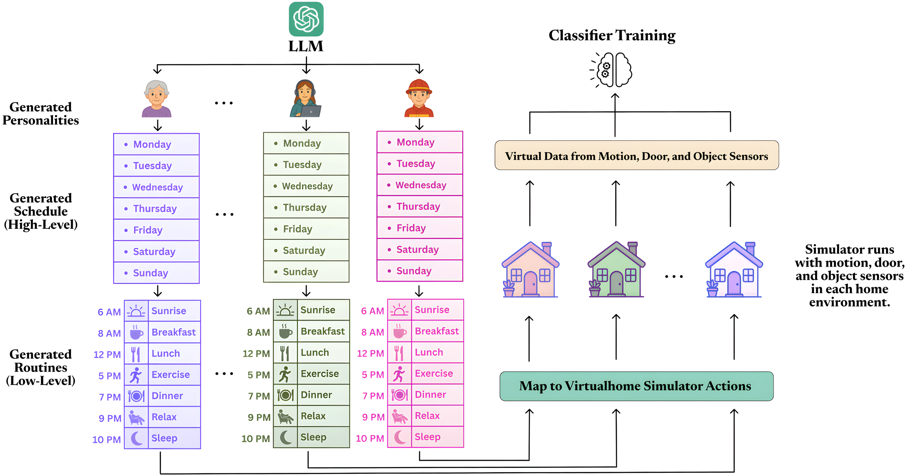

# AgentSense: Virtual Sensor Data Generation Using LLM Agents in Simulated Home Environments

[](https://arxiv.org/abs/2506.11773)
[](LICENSE)



A major challenge in Human Activity Recognition (HAR) for smart homes is the lack of large, diverse, and labeled datasets. Variations in home layouts, sensor configurations, and individual behaviors make generalization difficult. 

**AgentSense** addresses this by leveraging LLM-guided embodied agents to live out daily routines in simulated smart homes. Our pipeline generates diverse synthetic personas and realistic routines grounded in the environment, which are then executed in an augmented VirtualHome simulator to produce rich, privacy-preserving sensor data.

## 🆕 News & Updates

- **[Jan 2026]** 🚀 Initial release of the AgentSense pipeline and simulation environment!
- **[Nov 2025]** 🎉 AgentSense has been accepted to AAAI 2026!
- **[June 2025]** 📄 Our paper "AgentSense: Virtual Sensor Data Generation Using LLM Agents in Simulated Home Environments" is now available on [arXiv](https://arxiv.org/abs/2506.11773)!

---

## 📂 Repository Structure

The project is organized into three main components:

| Directory | Description |
| :--- | :--- |
| [**`AgentSense_pipeline/`**](./AgentSense_pipeline/) | LLM-based generation of personas, schedules, and activity scripts (Steps 1-9, 11). |
| [**`VirtualHome_API/`**](./VirtualHome_API/) | Modified VirtualHome simulator for script execution and sensor data collection (Step 10). |


---

## 🚦 Getting Started


1. **LLM Pipeline**:
   - Navigate to `AgentSense_pipeline/`.
   - Run the notebooks sequentially (Step 1 to Step 9).
   - [Detailed Guide](./AgentSense_pipeline/AgentSense%20Generating%20Daily%20Household%20Activity%20Scr%202d7d5ba10f4080ad8983f8f3e867e90f.md)

2. **Simulator**:
   - Navigate to `VirtualHome_API/`.
   - **Download the Unity Simulator**:  Please download them from https://drive.google.com/file/d/1HyOcPDV6_eLiwbCfMTYrj98he2Sqa5Fs/view?usp=sharing and extract the contents into the `VirtualHome_API/exe/` directory.
   - Set up the environment.
   - Run the simulation (Step 10).
   - [Detailed Guide](./VirtualHome_API/AgentSense%20Server%20Environment%20Setup%20and%20Synthetic%20%202d6d5ba10f4080939e12ef9eff360f2d.md)


---

## 📜 Citation

If you use AgentSense in your research, please cite our paper:

```bibtex
@misc{leng2025agentsensevirtualsensordata,
      title={AgentSense: Virtual Sensor Data Generation Using LLM Agents in Simulated Home Environments}, 
      author={Zikang Leng and Megha Thukral and Yaqi Liu and Hrudhai Rajasekhar and Shruthi K. Hiremath and Jiaman He and Thomas Plötz},
      year={2025},
      eprint={2506.11773},
      archivePrefix={arXiv},
      primaryClass={cs.CV},
      url={https://arxiv.org/abs/2506.11773}, 
}
```


