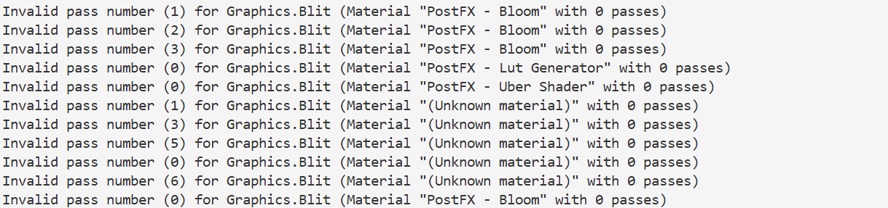
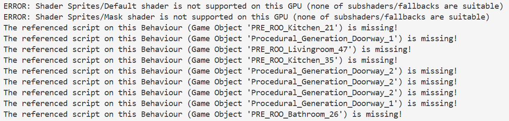
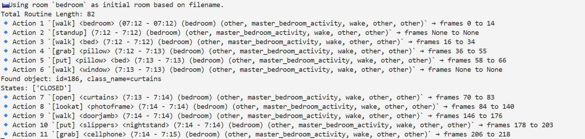

# AgentSense: Server Environment Setup and Synthetic Data Generation Using the VirtualHome Simulator

# Step 1: Operating System Requirements

The server should run a Linux-based operating system.

We **recommend Ubuntu 22.04.5 LTS** for compatibility with Conda, CUDA, and modern machine learning libraries.

To verify your Ubuntu version:

```bash
cat /etc/os-release
```

# Step 2: Miniconda Installation and Environment Setup

## 2.1 Update system packages and install prerequisites

```bash
apt-get update && apt-get install -y wget curl bzip2
```

## 2.2 Download the Miniconda installer

```bash
wget https://repo.anaconda.com/miniconda/Miniconda3-latest-Linux-x86_64.sh
```

## 2.3 Install Miniconda in batch mode

Install Miniconda **non-interactively** to a user-specified directory:

```bash
bash Miniconda3-latest-Linux-x86_64.sh -b -p <INSTALL_PATH>
```

Replace `<INSTALL_PATH>` with the desired installation directory (e.g., `/workspace/miniconda3`, `/opt/miniconda3`, or `$HOME/miniconda3`).

## 2.4 Add Miniconda to PATH

Add the Miniconda binary directory to your `PATH` so that `conda` is available in all shell sessions:

```bash
echo 'export PATH="<MINICONDA_PATH>/bin:$PATH"' >> ~/.bashrc
```

Replace `<MINICONDA_PATH>` with the directory where Miniconda was installed (e.g., `/workspace/miniconda3`, `/opt/miniconda3`, or `$HOME/miniconda3`).

Reload the shell configuration:

```bash
source ~/.bashrc
```

## 2.5 Initialize Conda

Initialize Conda for the current shell so that `conda activate` works correctly:

```bash
conda init bash
```

Restart the shell to apply the changes:

```bash
exec bash
```

## 2.6 Verify Installation

Verify that Conda is installed and accessible:

```bash
conda --version
```

# Step 3: Create the `AgentSense` Conda Environment and Install System Dependencies

## 3.1 Create and activate the Conda environment

```bash
conda create -n AgentSense python=3.10 -y
conda activate AgentSense
```

## 3.2 Install required system packages (Ubuntu/Debian)

If you are root (common in containers): run without sudo

```bash
apt-get update
apt-get install -y xvfb libgl1-mesa-glx libglib2.0-0 pciutils
```

If you are a regular user (non-root server): use sudo

```bash
sudo apt-get update
sudo apt-get install -y xvfb libgl1-mesa-glx libglib2.0-0 pciutils
```

# Step 4: Install the VirtualHome Simulator (AgentSense Environment)

All commands in this step should be executed **inside the `AgentSense` Conda environment**.

Activate the environment first:

```bash
conda activate AgentSense
```

## 4.1 Download the VirtualHome API repository

Download or copy the `VirtualHome_API` folder to a directory of your choice on the server.

Example (using Git):

```bash
git clone <REPO_URL>
```

Alternatively, upload or copy the `VirtualHome_API` folder manually to the server filesystem.

## 4.2 Install the VirtualHome Python package

Navigate to the **VirtualHome_API** directory:

```bash
cd <PATH_TO_VIRTUALHOME_API>/VirtualHome_API
```

Install the package using `setup.py`:

```bash
python setup.py install
```

This installs the `virtualhome` Python module into the currently active Conda environment.

## 4.3 Install VirtualHome dependencies

Navigate to the VirtualHome Python package directory:

```bash
cd <PATH_TO_VIRTUALHOME_API>/VirtualHome_API/virtualhome
```

Install the additional Python dependencies required by VirtualHome:

```bash
pip install -r requirements.txt
```

These dependencies support the simulator’s functionality and runtime requirements.

### Notes

- Ensure the correct Conda environment (e.g., `AgentSense`) is activated before executing these commands.
- Replace `<PATH_TO_VIRTUALHOME_API>` with the directory where the `VirtualHome_API` repository is located.

# Step 5: Launch the VirtualHome Simulator

Running the VirtualHome simulator requires **two terminal sessions**, both with the **AgentSense Conda environment activated**:

- **Terminal 1**: Launches the VirtualHome simulator executable
- **Terminal 2**: Runs activity scripts that communicate with the simulator

## 5.1 Prepare and launch the VirtualHome simulator (Terminal 1)

Activate the `AgentSense` Conda environment:

```bash
conda activate AgentSense
```

Navigate to the VirtualHome executable directory:

```bash
cd <PATH_TO_VIRTUALHOME_API>/VirtualHome_API/exe
```

Ensure NumPy compatibility required by the simulator:

```bash
conda install "numpy<2.0" -y
```

Grant execution permission to the simulator binary:

```bash
chmod +x a8.x86_64
```

After granting execution permission, start a virtual display and launch the simulator in headless mode:

```bash
Xvfb :0 -screen 0 1280x1024x24 &
export DISPLAY=:0
./a8.x86_64 -batchmode -nographics -port 8080
```

**Explanation (brief):**

- `Xvfb` creates a virtual X display for headless rendering.
- `DISPLAY=:0` directs the simulator to use that display.
- The simulator is launched in batch mode without graphics and listens on port `8080`.

During execution, the script may print many messages, including warnings such as “error” or “invalid pass number.” As long as the program continues running, these messages can be safely ignored.

You may see outputs like the examples below, which is expected and does not indicate a failure.





**Keep this terminal running while executing activity scripts in Terminal 2.** The simulator must remain active to accept incoming connections.

### Managing the virtual display process (if needed)

If you need to verify or stop the virtual display (`Xvfb`) process, you can use the following commands:

Check running X-related processes:

```bash
ps -ef | grep X
```

Terminate the `Xvfb` process if necessary:

```bash
kill -9 <PID>
```

Replace `<PID>` with the process ID corresponding to the `Xvfb` instance.

## 5.2: Run the AgentSense Activity Script Generation Pipeline (Terminal 2)

### 1. Open **Terminal 2** and activate the **same AgentSense Conda environment**.

- Make sure **Terminal 1 is still running** the simulator.

### 2. Generate an AgentSense activity script using the script-generation pipeline.

- Refer to the provided [**AgentSense: Generating Daily Household Activity Scripts Using Large Language Models**](https://www.notion.so/AgentSense-Generating-Daily-Household-Activity-Scripts-Using-Large-Language-Models-2d7d5ba10f4080ad8983f8f3e867e90f?pvs=21) for detailed instructions.
- The script file should be generated in **Step 9** of the script-generation pipeline, and the filename should follow the format below:

```
part_{#}_label_regenerated_{character_name}_routine_env_{#}_{day}_parsed_grounded_{location}.txt
```

### **3. Move the script file to the VirtualHome directory**:

```
<PATH_TO_VIRTUALHOME_API>/VirtualHome_API/virtualhome/
```

### 4. Important Execution Requirements

**4.1 Script File Location**

When running `generate_scripts.py`, the activity script file **must be placed directly in the following directory**:

```
<PATH_TO_VIRTUALHOME_API>/VirtualHome_API/virtualhome/
```

This is required because the script path is resolved relative to the `virtualhome/` directory.

**4.2 Configure the Output Directory (Required)**

By default, `generate_scripts.py` writes outputs to a Docker-specific path. This must be updated for **your local execution**.

1. Open:
    
    ```
    synthetic_sensor_simulation/generate_scripts.py
    ```
    
2. Locate the `output_dir` definition (around line ~149) and change:
    
    ```python
    output_dir = '/workspace/VirtualHome_API/virtualhome/rendered_output'
    ```
    
    to:
    
    ```python
    output_dir = '<PATH_TO_VIRTUALHOME_API>/VirtualHome_API/virtualhome/rendered_output'
    ```
    

All generated synthetic data will now be saved under your local `rendered_output/` directory.

**4.3 Script Execution Command**
Since the script file is located in the `virtualhome/` directory, it **must be executed from this directory** using:

```bash
python synthetic_sensor_simulation/generate_scripts.py --script_file <script_file_name>
```

**Important:**

The script file name is interpreted relative to the `virtualhome/` directory. Placing the script file elsewhere will cause execution to fail.

If running correctly, it should looks like the following:



If execution fails partway through the run—which can occasionally happen—using one of the recommended household environments (e.g., **env_0**, **env_8**, as listed in the final cell of the Step 3 code within the `AgentSense_pipeline` folder) can significantly reduce the likelihood of failure in most cases.

If the script still fails midway, displays errors, or stops unexpectedly, fully shut down the server, restart it, and relaunch the **Terminal 1** process. Do **not** attempt to rerun the same script file; instead, skip it and proceed to the next script.

### 5. Output Files After Execution

**The motion location data and frame outputs are located at:**

```
<PATH_TO_VIRTUALHOME_API>/VirtualHome_API/virtualhome/rendered_output/<script_file_name>/0/
```

In this directory, you will find `.png` files indexed by frame number. These files correspond to individual simulation frames. When opened, the images may appear blank; this is expected behavior. The simulator was launched with the `-nographics` option in the first terminal, which disables visual rendering. Since rendering is not required for data generation, this setting is correct.

The motion location data files follow the naming format below:

```
motion_<script_file_name>.txt.txt
```

Note that the **first `.txt` is part of the filename**, while the **second `.txt` is the file extension**. This duplicated extension appears to be a minor issue within the simulator’s output naming and does not affect downstream processing. In some cases, the simulator may generate only blank `.png` frame files without producing motion data; when this happens, the corresponding character should be skipped. This behavior is due to occasional internal issues within the simulator.

Example filename:

```
motion_part_1_label_regenerated_Sarah_routine_env_0_Monday_parsed_grounded_bedroom.txt.txt
```

**The activity-to-frame-range mapping files are located at:**

```
<PATH_TO_VIRTUALHOME_API>/VirtualHome_API/virtualhome/rendered_output/
```

Each range file records the frame index ranges corresponding to high-level activities and follows the naming format below:

```
range_<script_file_name>.txt
```

Example:

```
range_part_1_label_regenerated_Sarah_routine_env_0_Monday_parsed_grounded_bedroom.txt
```

These range files associate each activity with its corresponding frame span in the simulation output.

**These two types of outputs will be further processed in Step 11 of [AgentSense: Generating Daily Household Activity Scripts Using Large Language Models](https://www.notion.so/AgentSense-Generating-Daily-Household-Activity-Scripts-Using-Large-Language-Models-2d7d5ba10f4080ad8983f8f3e867e90f?pvs=21), where they are converted into sensor data and used for downstream analysis and model training.**