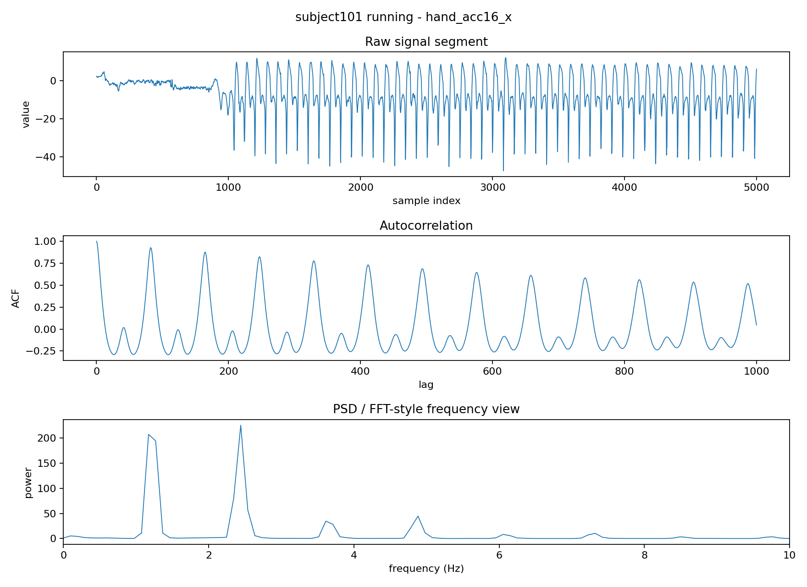
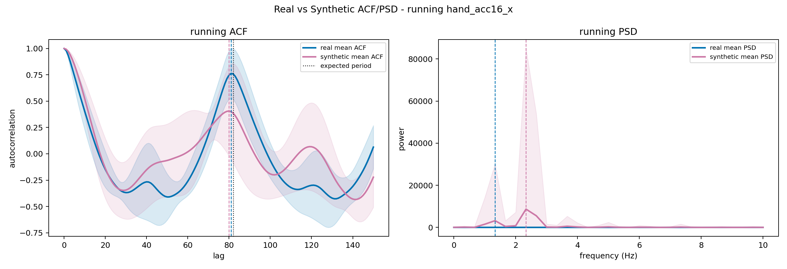
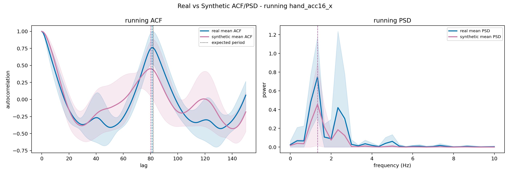

# Activity-Conditioned SDForger on PAMAP2

Advisor update · 3-slide progress summary

<h3>Previous recovered setup</h3>

- PAMAP2 subject101
- Mixed non-zero activities
- Single channel: `hand_acc16_x`
- No activity label in processed parquet
- Unconditioned SDForger-style generation

<h3>Current controlled setup</h3>

- PAMAP2 subject101
- Walking / running only
- Single channel: `hand_acc16_x`
- Activity text as condition
- Baseline + conditional generation

Running was selected as a controlled periodic HAR signal; walking is the paired activity in the current setup.

We moved from recovering a mixed-activity baseline to a controlled HAR generation task.

<!--
Speaker notes:
The old Puhti code is useful, but it used a processed PAMAP2 file where all non-zero activities were mixed and the activity labels were not kept. That setup can show that the SDForger pipeline runs, but it cannot directly answer whether we can generate a requested HAR activity.

For the current work, I narrowed the setting to subject101, walking and running, and one interpretable channel, hand_acc16_x. The point is not that this is the final HAR benchmark. The point is to isolate a clean activity-conditioned generation problem before moving to multi-subject or multichannel data.
-->

---

# Activity conditioning works, but the unified generator is unstable

Condition: data is walking/running 
+ FICA embedding text 
→ LLM fine-tuning / generation 
→ decoded synthetic sensor window

<table class="metric-table" style="margin-top:0.8rem;">
<thead>
<tr><th>Diagnostic</th><th>Raw unified</th></tr>
</thead>
<tbody>
<tr><td>Label controllability</td><td class="num">0.8212</td></tr>
<tr><td>Walking abs max</td><td class="num">3761.8</td></tr>
<tr><td>Running abs max</td><td class="num">1572.1</td></tr>
<tr><td>Synthetic-only HAR</td><td class="num">0.4955</td></tr>
</tbody>
</table>

Unified label-conditioned generation before latent constraint.

The model learns activity-label signal, but unconstrained generated latents can leave the valid sensor range.

<!--
Speaker notes:
This follows the language-shaping idea from SDForger Section 6. In the paper, the condition is channel identity, such as temp, count, or humidity. Here, I adapt the same idea to activity identity: walking or running.

I tested two versions. First, activity-specific models: walking-only and running-only with activity text. Second, a unified walking/running model, where one model is asked to generate the requested activity. The unified version is the more interesting one because it tests true conditional generation.

The classifier-based controllability score is not a TSGBench metric. It asks: if I request walking, does the generated window look walking-like to a classifier trained on real data? The raw unified model gets 0.8212, so the label signal is there.

But the generated values can explode after decoding. Since these windows are in standardized SDForger space, abs max values in the thousands are clearly invalid. This is a sanity-check failure, not just a small metric degradation.
-->

---

# Latent validity constraint improves stability

<table class="metric-table">
<thead>
<tr><th>Metric</th><th>Raw unified</th><th>`clip_p05_p95`</th></tr>
</thead>
<tbody>
<tr><td>Walking abs max</td><td class="num">3761.8</td><td class="num">3.24</td></tr>
<tr><td>Running abs max</td><td class="num">1572.1</td><td class="num">2.65</td></tr>
<tr><td>Label controllability</td><td class="num">0.8212</td><td class="num">0.9868</td></tr>
<tr><td>Synthetic-only HAR</td><td class="num">0.4955</td><td class="num">0.6937</td></tr>
</tbody>
</table>

<h3>Next method step</h3>

Generate candidate latent → check validity → accept/reject → decode.

After percentile latent constraint, running recovers reasonable value scale and rhythm diagnostics.

The current direction is not just more data; it is controlled conditional generation with latent validity checks.

<!--
Speaker notes:
To diagnose the failure, I constrained generated latent values to the training latent distribution before decoding. The best diagnostic variant clips each latent dimension to the 5th-95th percentile range observed in training.

This is still post-hoc, so I would not present it as a final method. But it strongly supports the diagnosis: the main failure mode is invalid generated latent values. After constraint, value explosion disappears, controllability improves, and synthetic-only HAR utility recovers.

Evaluation explanation:
1. abs max/std are sanity checks for value explosion.
2. ACF/PSD check motion rhythm and frequency structure.
3. label controllability checks whether the requested activity affects generation.
4. synthetic-only HAR trains on synthetic windows and tests on real held-out windows, following the downstream utility idea from the advisor feedback.

The next step is generation-time latent validity control or rejection sampling, where invalid candidates are rejected before decoding. After that is stable, we can extend to multi-subject training to increase data and reduce subject-specific bias, and then to multichannel data such as hand plus ankle acceleration.
-->
